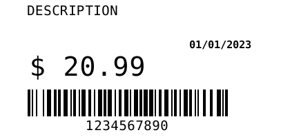

TSPL

```java
BluethoothPrinter printer = 
    new BluethoothPrinter("02:00:00:00:00:00");

try {
  printer.open(4000);
  printer.writeString("CLS\n" +
    "SIZE 51.0 mm, 25.0 mm\n" +
    "GAP 3.0 mm, 0.0 mm\n" +
    "DIRECTION 0,0\n" +
    "REFERENCE 0,0\n" +
    "OFFSET 0.0 mm\n" +
    "CLS\n" +
    "CODEPAGE UTF-8\n" +
    "TEXT 23, 18, \"D.FNT\", 0, 1, 1, \"DESCRIPTION\"\n" +
    "TEXT 290, 85, \"B.FNT\", 0, 1, 1, \"01/01/2023\"\n" +
    "TEXT 40, 82, \"4\", 0, 1, 0, \"$ 20.99\"\n" +
    "BARCODE 22,135 ,\"128M\" ,36 ,2 ,0 ,2 ,4 ,\"1234567890\"\n" +
    "PRINT 1, 1\n")

} finally {
  printer.close(2000);
}
```

ZPL
```java
BluethoothPrinter printer = 
    new BluethoothPrinter("02:00:00:00:00:00");

try {
  printer.open(4000);
  printer.writeString("^XA\n" +
    "^PW407\n" +
    "^LL199\n" +
    "^MNY,23\n" +
    "^LH0,0\n" +
    "^PON\n" +
    "^CI28\n" +
    "^FO40,8\n" +
    "^ADN,18,10\n" +
    "^FB375,3,1,L,0\n" +
    "^FH\\^FDDESCRIPTION^FS\n" +
    "^FO275,59\n" +
    "^ABN,11,7\n" +
    "^FH\\^FD01\\2F01\\2F2023^FS\n" +
    "^FO45,82\n" +
    "^ADN,36,20\n" +
    "^FH\\^FD\\24 20\\2E99^FS\n" +
    "^FO40,130\n" +
    "^BY2\n" +
    "^BCN,39,Y,N,N\n" +
    "^FH\\^FD1234567890^FS\n" +
    "^PQ1,0,1,Y\n" +
    "^XZ\n")

} finally {
  printer.close(2000);
}
```


